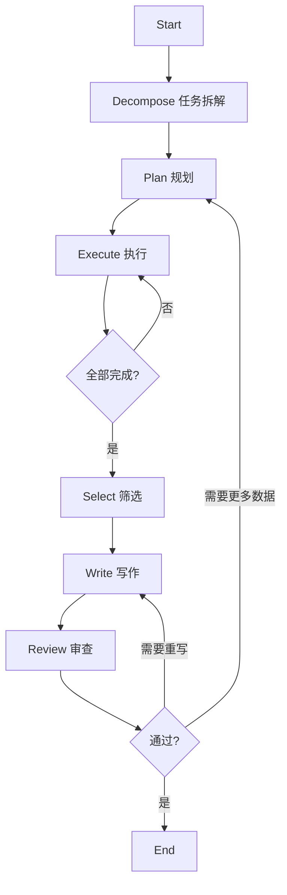

# Deep Research System

基于 LangGraph 的多智能体深度研究系统，采用 "Roma" 模式实现自动化研究流水线。

## 特性

- 🔄 **多智能体协同**: 任务拆解、规划、执行、筛选、写作、审查六大Agent
- 🔗 **LangGraph编排**: 基于状态图的工作流管理，支持条件路由和循环
- 📚 **多数据源集成**: Web搜索(Tavily/Google/Bing) + RAGFlow知识库 + MCP协议
- 📝 **学术级引用**: 自动引用管理，生成规范的参考文献列表
- ⚙️ **高度可配置**: YAML配置文件，支持环境变量，每个Agent可独立配置LLM
- 🧪 **Mock模式**: 完整的Mock实现，便于测试和演示

## 工作流程



## 快速开始

### 1. 安装依赖

```bash
cd deep_research
pip install -r requirements.txt
```

### 2. 配置环境变量

```bash
# 复制示例配置
cp .env.example .env

# 编辑 .env 文件，填入你的API密钥
```

### 3. 运行演示

```bash
# 使用Mock模式演示（无需API密钥）
python demo.py

# 查看工作流程图
python main.py --visualize
```

### 4. 运行真实研究

```bash
# 基础用法
python main.py "人工智能在医疗领域的应用"

# 指定输出目录和详细模式
python main.py "量子计算的发展现状" -o ./output -v

# 使用Mock工具测试
python main.py "测试问题" --mock
```

### 5. 查看运行进度与中间结果

运行到哪一步、每步的中间结果可以这样查看：

```bash
# 每步完成后在控制台打印当前状态摘要（子任务、数据条数、草稿预览、审查结果等）
python main.py "你的研究问题" --show-state

# 同时显示本步更新的字段（workflow_status、子任务数、原始数据条数等）
python main.py "你的研究问题" -v --show-state

# 每步完成后把中间状态保存为 JSON 到输出目录（或 ./intermediate）
python main.py "你的研究问题" -o ./output --save-intermediate
```

**状态摘要包含：**
- 子任务列表（ID、问题摘要）
- 执行计划（task_plan）
- 当前执行到第几个任务（current_task_index）
- 原始数据条数（按搜索/RAG 分类）
- 筛选后数据条数
- 报告草稿字数与预览
- 审查结果（通过/路由、问题列表）
- 错误列表（如有）

**保存的中间状态 JSON：** 每步一个文件，如 `state_step_01_decompose.json`、`state_step_02_plan.json`，便于事后分析或调试。

## 配置说明

### 多LLM API配置 (config/settings.yaml)

**每个Agent可以使用完全不同的LLM API**，包括不同的提供商、模型和参数：

```yaml
llm:
  # 默认配置
  default:
    base_url: "https://api.openai.com/v1"
    api_key: "${OPENAI_API_KEY}"
    model: "gpt-4o"
  
  # 每个Agent独立配置
  agents:
    # 任务拆解 - 使用DeepSeek (便宜)
    decompose:
      base_url: "https://api.deepseek.com/v1"
      api_key: "${DEEPSEEK_API_KEY}"
      model: "deepseek-chat"
      temperature: 0.5
    
    # 执行 - 使用本地Ollama (免费)
    execution:
      base_url: "http://localhost:11434/v1"
      api_key: "ollama"
      model: "qwen2.5:14b"
    
    # 写作 - 使用GPT-4o (高质量)
    writing:
      base_url: "https://api.openai.com/v1"
      api_key: "${OPENAI_API_KEY}"
      model: "gpt-4o"
      max_tokens: 8192
```

**支持的API提供商**：
| 提供商 | base_url | 环境变量 |
|--------|----------|----------|
| OpenAI | `https://api.openai.com/v1` | `OPENAI_API_KEY` |
| DeepSeek | `https://api.deepseek.com/v1` | `DEEPSEEK_API_KEY` |
| Qwen | `https://dashscope.aliyuncs.com/compatible-mode/v1` | `QWEN_API_KEY` |
| 智谱GLM | `https://open.bigmodel.cn/api/paas/v4` | `ZHIPU_API_KEY` |
| Moonshot | `https://api.moonshot.cn/v1` | `MOONSHOT_API_KEY` |
| Ollama | `http://localhost:11434/v1` | 不需要 |
| OneAPI | `http://localhost:3000/v1` | `ONEAPI_API_KEY` |

> 参考 `config/settings.example.yaml` 获取完整的多LLM配置示例

### 工具配置 (config/tools_config.yaml)

```yaml
search:
  provider: "tavily"  # tavily, google, bing
  tavily:
    api_key: "${TAVILY_API_KEY}"

ragflow:
  enabled: true
  base_url: "http://localhost:9380"
  api_key: "${RAGFLOW_API_KEY}"
```

## 项目结构

```
deep_research/
├── config/           # 配置文件
├── core/             # 核心模块
│   ├── state.py      # 状态定义
│   ├── llm_client.py # LLM客户端
│   └── citation_manager.py  # 引用管理
├── agents/           # Agent实现
│   ├── prompts/      # Prompt模板
│   ├── decompose.py  # 任务拆解
│   ├── plan.py       # 规划
│   ├── execution.py  # 执行
│   ├── selection.py  # 筛选
│   ├── writing.py    # 写作
│   └── review.py     # 审查
├── tools/            # 工具封装
│   ├── search_provider.py   # 搜索
│   ├── ragflow_provider.py  # RAGFlow
│   └── mcp_client.py        # MCP
├── workflow.py       # 工作流定义
├── main.py           # 入口
└── demo.py           # 演示脚本
```

## 测试

```bash
# 运行所有测试
pytest tests/ -v

# 运行特定测试
pytest tests/test_basic.py -v
pytest tests/test_workflow_mock.py -v
```

## 扩展指南

### 添加新的搜索提供商

1. 在 `tools/search_provider.py` 中创建新的Provider类
2. 继承 `BaseSearchProvider` 并实现 `search` 方法
3. 在 `SearchProvider` 工厂类中注册

### 添加新的Agent

1. 在 `agents/prompts/` 中创建prompt文件
2. 在 `agents/` 中创建agent实现
3. 在 `workflow.py` 中添加节点和边

### 自定义工作流

```python
from workflow import create_workflow

# 创建自定义工作流
workflow = create_workflow()

# 添加新节点
workflow.add_node("my_node", my_node_function)

# 编译
compiled = workflow.compile()
```

## 许可证

MIT License
